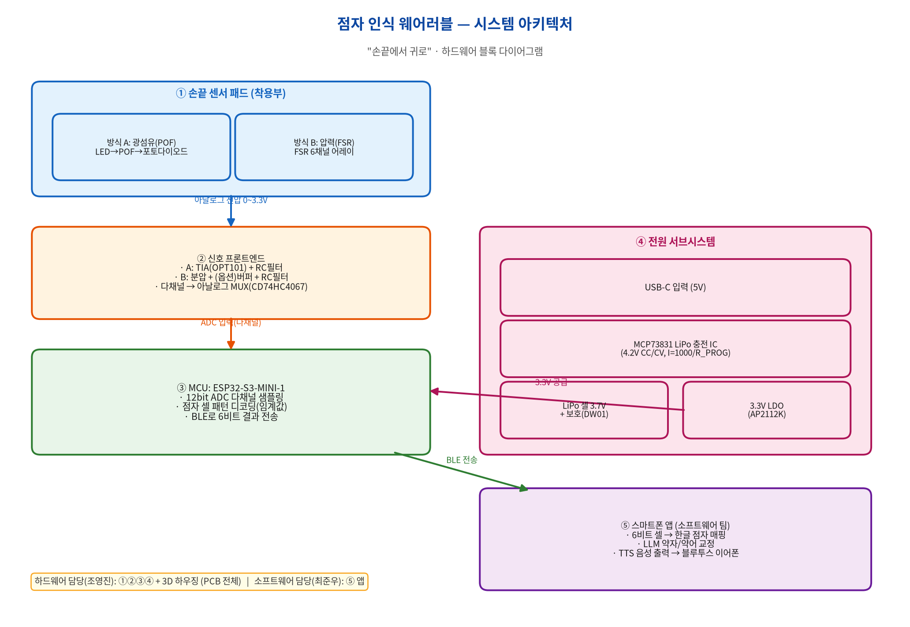

점자 인식 웨어러블 기기의 하드웨어(센서 회로 · PCB · 3D 하우징 · 펌웨어) 설계 자료입니다. 담당: **조영진, 유동형**.

## 시스템 구성

기기는 크게 네 부분으로 이루어집니다.

1. **손끝 센서 패드** — 광섬유(POF) 또는 압력(FSR) 센서로 점자 돌기를 감지
2. **신호 프론트엔드** — 센서 신호를 증폭·필터링해 마이크로컨트롤러가 읽을 수 있게 변환
3. **메인 보드 (ESP32-S3)** — 신호 디코딩 + 블루투스 전송
4. **전원 서브시스템** — LiPo 배터리 + USB-C 충전 + 3.3V 전원

## 설계 문서

전체 설계 패키지(회로 스케매틱, 부품 명세서 BOM, PCB 레이아웃 가이드, Fusion 360 3D 설계, 펌웨어 골격)는 아래 문서에 정리되어 있습니다.

  <a class="card" href="design_package">
    
📐

    <h3>전체 설계 패키지</h3>
    
회로·BOM·PCB·3D·펌웨어 종합 가이드

  </a>
  <a class="card" href="../downloads">
    
📦

    <h3>설계 파일 다운로드</h3>
    
Fusion 360 스크립트, 다이어그램

  </a>

## 핵심 사양 요약

| 항목 | 선정 | 비고 |
|---|---|---|
| 마이크로컨트롤러 | ESP32-S3-MINI-1 | 블루투스(BLE) 내장, 12bit ADC |
| 센서 (방식 A) | 광섬유 POF + OPT101 | 광량 변화 측정 |
| 센서 (방식 B) | Interlink FSR 402 | 압력 변화 측정 |
| 충전 IC | MCP73831 | 단일셀 LiPo, USB-C 입력 |
| 전원 | LiPo 3.7V + 3.3V LDO | 웨어러블용 소형 배터리 |

> 모든 부품 사양은 공식 데이터시트를 근거로 합니다. 상세 출처는 [전체 설계 패키지](design_package) 문서의 부록을 참고하세요.
